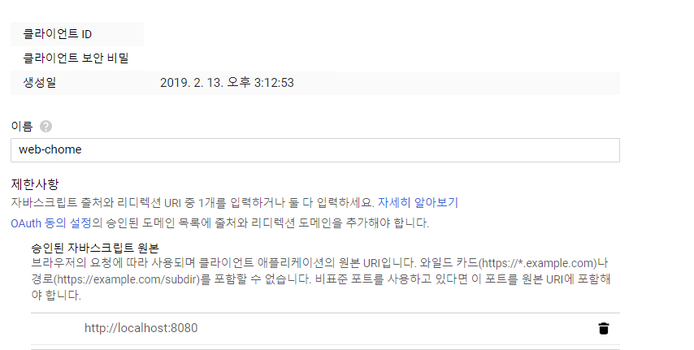
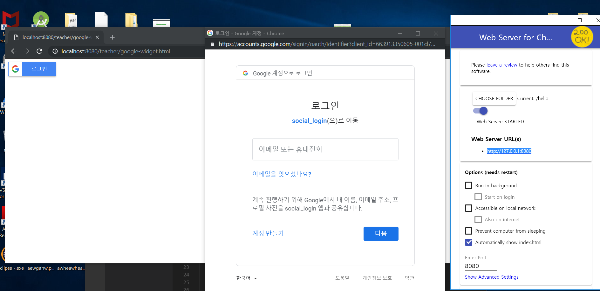
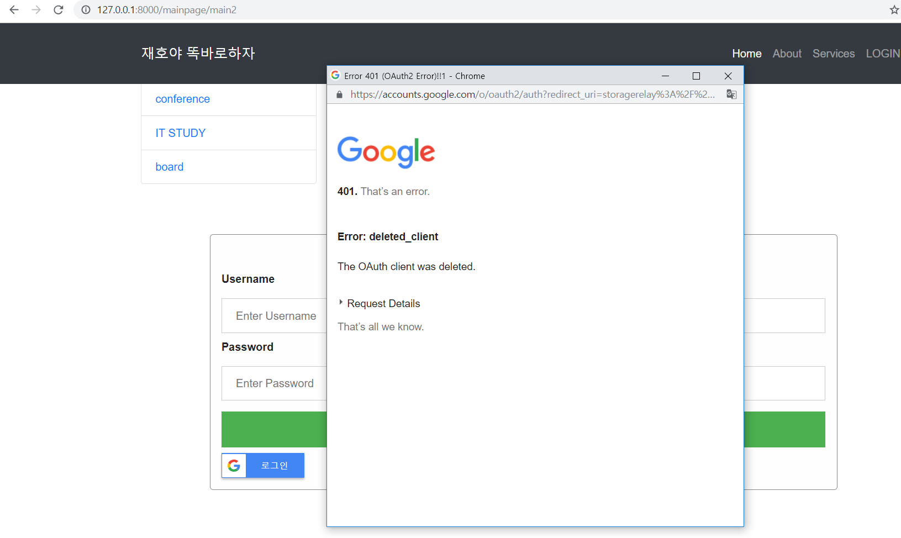

### Web server for Chrome vs Django venv server

   - 저는 Web server for Chrome의 http://127.0.0.1:8080 (localhost)로 api에 추가를 하였더니
   잘 되길래 현재 프로젝트를 하고있는 django에도 똑같이 넣어보았습니다.  
    
    

잘들어가는 것을 확인할 수 있다.

 
- 하지만 Django venv server 가상환경으로
    로컬서버를 열고 입력했을 경우에는 400에러가 뜨는 것을 확인할 수 있다.  

    

결론은 Web server for Chrome에서는 localhost자체에 DNS를 지원해줘서(127.0.0.1) google cloud platform에 바로 넣어도 실행이 가능하지만 Django venv server에서는 지원하지 않아서(해킹 문제때문에 localhost를 지원하지 않음 만약 지원하게 된다면 외부 사람들이 localhost라는 것을 입력한 후 바로 접근이 가능하다.)localhost라고 입력해도 방화벽에 막혀서 들어가지 못한다.

그래서 방화벽을 풀어주거나 해당 포트번호만 열어주는 방식으로 프로젝트를 진행하고 마지막으로
DOMAIN이 완성 되었을 경우에는 그 도메인으로 다시 API를 연결해주면 된다.

제대로 된 예 (방화벽을 열고)
http://localhost:8000/mainpage/main2

잘못된 예(방화벽을 닫고)
http://127.0.0.1:8000/mainpage/main2

<참고>
포트포워딩 : 공유기에 할당받은 ip는 외부로 노출이 되지 않기 떄문에 공유기에게 내 ip를 알려주는 행위

